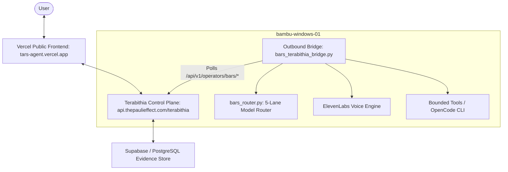

# BARS / TARS System Architecture

## Component Architecture
1. **Frontend**: Next.js / Edge Runtime deployed on Vercel (`tars-agent.vercel.app`).
2. **Control Plane Authority**: Terabithia bridge runtime on VPS (`31.220.58.212`), providing mission queues, policies, and audit logging.
3. **Evidence Layer**: PostgreSQL / Supavisor on port 5434 storing release receipts, execution evidence, and event streams.
4. **Execution Worker**: Sovereign Windows worker `bambu-windows-01` connecting outbound via `BARS_REMOTE_TOKEN`.
5. **Model Routing Layer**:
   - `DIRECT`: Fast deterministic or lightweight queries.
   - `FLASH`: Fast generative tasks (`gemini-2.5-flash`, `gpt-4o-mini`).
   - `WORKER`: Implementation tasks (`claude-3-5-sonnet`, `gemini-2.5-pro`).
   - `REASONER`: Deep analytical / architectural problems (`o3-mini`, `deepseek-r1`).
   - `JUDGE`: Final output verification and safety evaluation.
